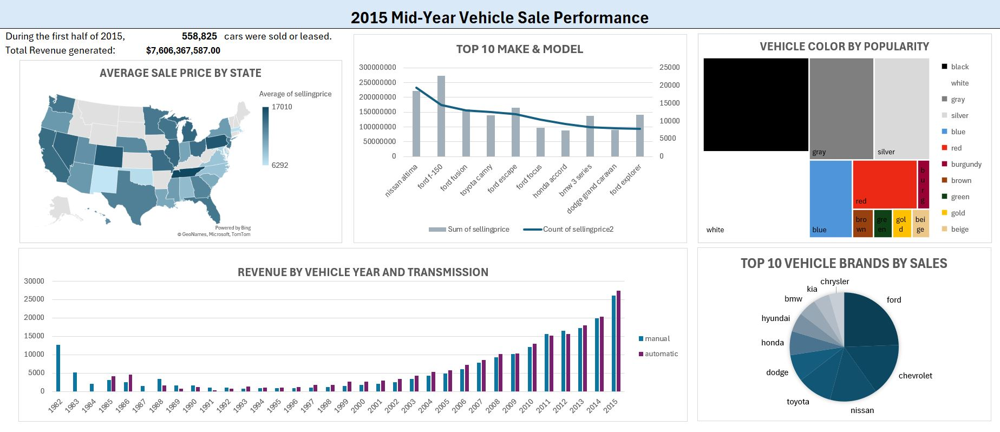

# Car Sales Dashboard (Excel)

## Overview

This project is an Excel dashboard built to explore and analyze 2015 vehicle sales data. It provides quick insights into sales performance by make, mileage, and year. This project demonstrates how Excel can be used to turn raw sales data into a clear, actionable dashboard with no code required.

---

## Project Objective

The goal of this project is to:

- Provide a clean dashboard to explore 2015 vehicle sales data.

- Summarize key metrics such as top-selling vehicle makes, mileage categories, and monthly sales.

- Enable user-friendly filtering and data exploration through Excel tools like slicers, and PivotTables.

---

## Data Source
-  This project utilizes 2015 vehicle sales data sourced from [Kaggle](https://www.kaggle.com/datasets/syedanwarafridi/vehicle-sales-data/data)

---

## Tools Used

- Microsoft Excel
- PivotTables & PivotCharts
- Slicers & Conditional Formatting

--- 

## Dashboard

View the Excel dashboard [here](dashboard_car_sales_2015.xlsx)

